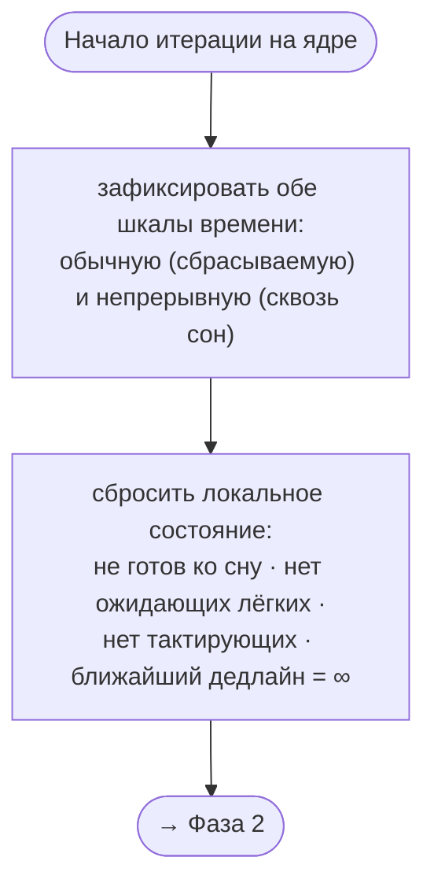
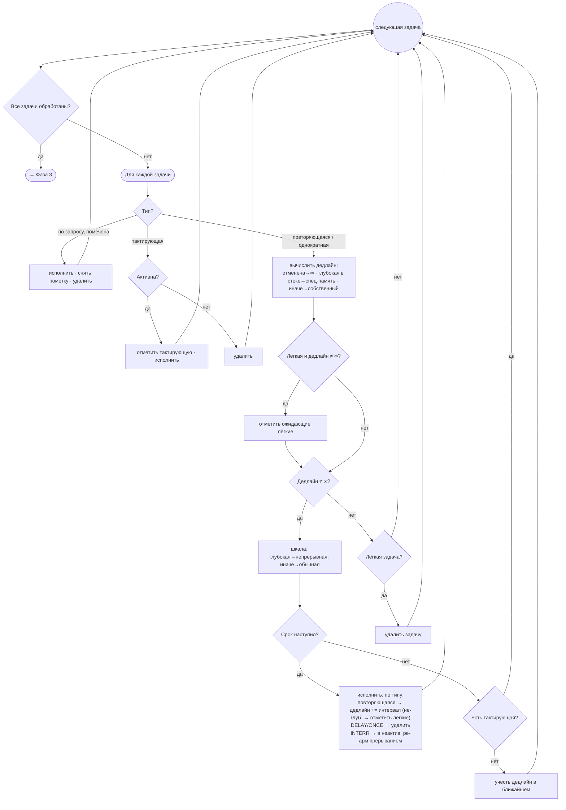
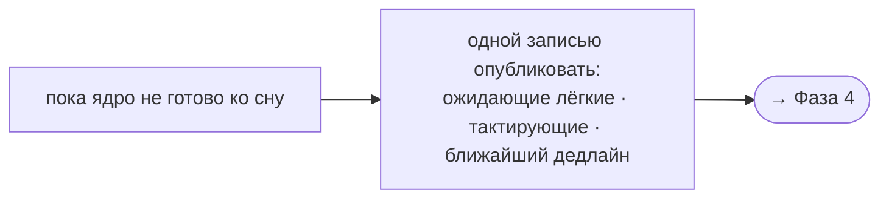
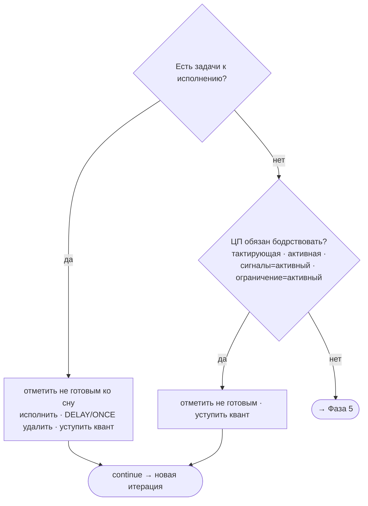
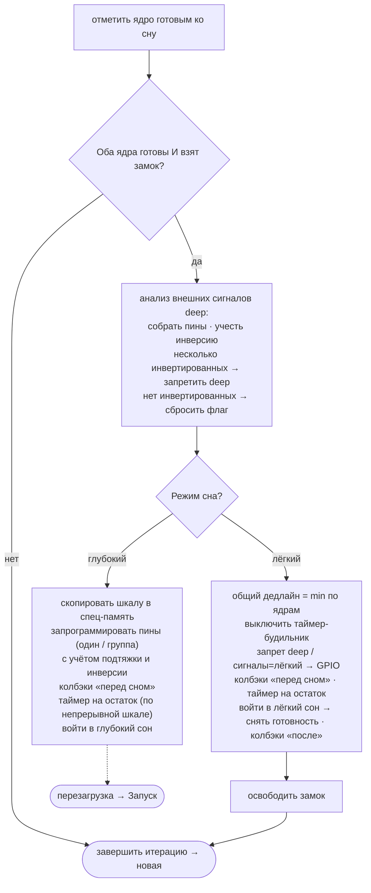

# Алгоритм асинхронного планировщика

Формализованное описание ядра: модель данных, жизненный цикл и алгоритм
цикла планировщика с выбором режима сна. Изложение абстрактно — без
привязки к конкретным идентификаторам, номерам строк или файлам.

---

## 1. Модель

### 1.1. Ядра и задачи
- Система имеет **два ядра** (0 и 1). На каждом ядре выполняется собственный
  цикл планировщика.
- На ядре зарегистрировано **множество задач**. Каждая задача обладает:
  - **типом** (поведением — см. 1.2);
  - **режимом сна** (см. 1.3);
  - **дедлайном** — следующим моментом срабатывания;
  - **интервалом** — у повторяющихся задач.

### 1.2. Типы задач (по поведению)
| Тип | Роль | Поведение |
|---|---|---|
| INIT | Стартовая | Исполняется один раз при инициализации, затем удаляется. |
| DEMAND | По запросу | Исполняется лишь после явной пометки; снимает пометку и удаляется. |
| TICK | Тактирующая | Пока активна — исполняется **каждый цикл** и удерживает ЦП от сна. |
| REPEAT | Повторяющаяся | Срабатывает каждые заданный интервал; переносит дедлайн вперёд. |
| DELAY | Отложенная | Срабатывает один раз через заданную задержку, затем удаляется. |
| ONCE | Однократная | Срабатывает один раз и удаляется. |
| INTERR | По прерыванию | Связана с внешним сигналом; срабатывает по событию и ре-армится. Автоматически не удаляется — только вместе с самим прерыванием. |

### 1.3. Режимы сна
- **Активный** — ЦП не спит (работа на аппаратном таймере).
- **Лёгкий** — ЦП засыпает с быстрым пробуждением, состояние в RAM сохраняется.
- **Глубокий** — ЦП засыпает с последующей **перезагрузкой** при пробуждении; RAM
  не сохраняется, переживает сон только специальная память.

### 1.4. Шкалы времени
Существуют **две шкалы**:
- **Обычная** — отсчитывается от старта, **сбрасывается** при выходе из глубокого сна.
- **Непрерывная** — **не сбрасывается**, продолжается сквозь все глубокие сны.

### 1.5. Что переживает глубокий сон
В специальной (переживающей сон) памяти хранятся:
- **Тайминги глубоких задач** — не более чем для **первых 20 слотов** каждого ядра.
  Поэтому глубокая задача обязана находиться среди этих слотов;
- **Настройки пробуждения по внешним сигналам** (ожидаемый уровень, подтяжка, флаг инверсии);
- **Любые иные настройки и состояния**, явно вынесенные пользователем/библиотекой в эту
  специальную память, — они сохраняются сквозь перезагрузку так же, как тайминги.

### 1.6. Источники пробуждения
- По **таймеру** (на остаток до ближайшего дедлайна);
- По **внешнему сигналу** на одном пине;
- По **внешнему сигналу** на группе пинов;
- По уровню GPIO (для лёгкого сна).

### 1.7. Состояние каждого ядра
В ходе цикла ядро перевычисляет и публикует:
- **Готовность ко сну**;
- **Наличие ожидающих лёгких задач** (удерживает от глубокого сна);
- **Наличие активной тактирующей задачи** (удерживает ЦП от сна);
- **Ближайший дедлайн** ядра (до него можно проспать).

---

## 2. Жизненный цикл

```
запуск системы (однократно):
    регистрация задач  →  инициализация  →  запуск (создаёт цикл на каждом ядре)

рабочий цикл (повторяется):
    работа цикла  →  подготовка ко сну  →  сон  →  пробуждение  ↺
```

### 2.1. Инициализация
1. Включить информационные логи планировщика.
2. На каждом ядре исполнить все **стартовые** задачи (однократно, с удалением).

### 2.2. Запуск
1. Защита от повторного запуска — при нарушении аварийный останов.
2. **Инвариант ёмкости:** глубокая задача должна находиться среди первых 20
   слотов своего ядра; иначе её тайминг не переживёт сон — аварийный останов.
3. Зафиксировать стартовую метку времени; создать разделяемый **замок засыпания**.
4. **Только при выходе из глубокого сна** (не при чистом старте):
   - вернуть из переживающей сон памяти сохранённые дедлайны глубоких задач:
     глубокий сон стирает RAM, поэтому перед сном ближайшие дедлайны глубоких
     задач были сохранены в специальной памяти — теперь их копируют обратно в
     рабочую память, чтобы после пробуждения задачи сработали вовремя, а не сразу;
   - вызвать колбэки пробуждения (режим «глубокий») на всех ядрах.
5. При пробуждении по внешнему сигналу — **инвертировать** флаг ожидаемого
   уровня (реализует toggle-кнопку: каждое пробуждение меняет ожидаемый уровень).
6. Создать по одной задаче-циклу на каждое ядро.

### 2.3. Подготовка ко сну
Этап наступает, когда оба ядра завершили работу и готовы ко сну. Одно из них
(захватившее замок засыпания) выполняет настройку за оба ядра:
1. **Анализ внешних сигналов** режима «глубокий»: собрать уникальные пины,
   учесть флаг инверсии; при нескольких инвертированных пинах — запретить
   глубокий сон.
2. **Выбор режима сна** (лёгкий или глубокий) по совокупности условий: запрет
   глубокого сна, наличие ожидающих лёгких задач, режим пробуждения по сигналам,
   ручное ограничение сна.
3. **Настройка источников пробуждения**: таймер на остаток до ближайшего
   дедлайна; внешние пины (один или группа) с учётом подтяжки и инверсии;
   для лёгкого сна — пробуждение по GPIO.
4. **Сохранение состояния глубокого сна**: скопировать рабочую шкалу глубоких
   задач в переживающую память (только для глубокого сна).
5. **Колбэки «перед сном»** по всем ядрам.

После подготовки ядро входит в выбранный режим сна (подробный алгоритм —
Фаза 5, раздел 3).

---

## 3. Цикл планировщика

Постоянный цикл на ядре. На каждой итерации — пять фаз подряд; Фазы 4 и 5
могут завершить итерацию досрочно и вернуться к началу.

### Фаза 1. Подготовка
1. Зафиксировать обе шкалы времени — обычную (сбрасываемую при выходе из
   глубокого сна) и непрерывную (сквозь все сны).
2. Сбросить локальное состояние: ядро не готово ко сну, нет ожидающих лёгких и
   тактирующих задач, ближайший дедлайн = ∞.


### Фаза 2. Обход задач ядра
1. Взять очередную задачу ядра и определить её тип.
2. **DEMAND** с пометкой — исполнить, снять пометку, удалить.
3. **TICK** активная — отметить тактирующую и исполнить (каждый цикл); неактивная
   — удалить.
4. **REPEAT/DELAY/ONCE/INTERR** — вычислить дедлайн: отменённая → ∞; глубокая в
   первых 20 слотах → из переживающей памяти; иначе собственный.
5. Ожидающая **лёгкая** задача с конечным дедлайном — отметить как удерживающую от
   глубокого сна.
6. Срок наступил — поставить на исполнение и обновить следующий дедлайн по типу:
   REPEAT переносит на интервал (не-глубокая форсирует лёгкий сон), DELAY/ONCE — к
   удалению, INTERR — в неактив с ре-армом прерыванием.
7. Срок не настал и нет тактирующей — учесть дедлайн в ближайшем для сна.
8. **Лёгкая** задача с дедлайном ∞ — удалить. Повторять для всех задач ядра.


### Фаза 3. Публикация состояния ядра
1. Одной записью опубликовать вычисленное состояние: наличие ожидающих лёгких
   задач, наличие тактирующей задачи, ближайший дедлайн.
2. Ядро, захватившее замок засыпания, читает целостный согласованный снимок без
   гонок с перевычислением соседнего ядра.


### Фаза 4. Исполнение готовых задач
1. Есть задачи к исполнению — отметить ядро не готовым ко сну, исполнить их
   (удалив DELAY/ONCE), уступить квант, начать новую итерацию.
2. Исполнять нечего, но ЦП обязан бодрствовать (тактирующая или активная задача,
   режим сигналов или ограничение = «активный») — уступить квант, начать новую
   итерацию.
3. Иначе — переход к Фазе 5.


### Фаза 5. Сон
1. Отметить ядро готовым ко сну.
2. Если оба ядра готовы и текущему удалось неблокирующе взять замок — оно одно
   настраивает сон за оба.
3. Анализ сигналов глубокого сна: собрать уникальные пины, учесть инверсию; при
   нескольких инвертированных — запретить глубокий сон, при отсутствии
   инвертированных — сбросить флаг.
4. Выбрать режим: **лёгкий** — если глубокий сон запрещён, есть ожидающая лёгкая
   задача, режим сигналов или ограничение = «лёгкий»; иначе **глубокий**.
5. **Лёгкий сон**: выключить таймер-будильник, при необходимости разрешить
   GPIO-пробуждение, колбэки «перед сном», таймер на остаток, заснуть; после
   пробуждения — снять готовность всех ядер, колбэки «после», освободить замок.
6. **Глубокий сон**: скопировать шкалу глубоких задач в переживающую память,
   запрограммировать пины (один или группа) с учётом подтяжки и инверсии, колбэки
   «перед сном», таймер на остаток по непрерывной шкале, заснуть → перезагрузка
   (новый старт — через раздел 2.2).


---

## 4. Инварианты и обоснования

- **Ёмкость глубоких задач.** Не более **20** глубоких задач на ядро — только
  первые 20 слотов имеют переживающие сон тайминги. Нарушение вызывает аварийный
  останов ещё до старта циклов.
- **Две шкалы.** Глубокие задачи живут на **непрерывной** шкале (их дедлайны
  корректны после пробуждения); прочие — на **сбрасываемой**.
- **Форсирование лёгкого сна.** Ожидающая лёгкая задача и сработавшая не-глубокая
  повторяющаяся задача ставят признак наличия лёгких задач — иначе глубокий сон
  сотрёт их состояние из RAM.
- **Восстановление шкалы — только при выходе из глубокого сна.** На чистом старте
  переживающий массив ещё нулевой, и безусловное восстановление затёрло бы первый
  дедлайн, заставив задачу сработать сразу, а не через интервал.
- **Согласованность снимка.** Публикация состояния ядра выполняется под снятой
  готовностью ко сну, поэтому ядро-настройщик сна читает целый снимок без гонок с
  перевычислением соседа.
- **Один спит за обоих.** Неблокирующий захват замка гарантирует единственного
  настройщика сна; второе ядро просто пропускает блок.
- **Toggle-инверсия.** Каждое пробуждение по внешнему сигналу инвертирует ожидаемый
  уровень (поведение toggle-кнопки). При **нескольких** инвертированных пинах
  глубокий сон запрещается, поскольку групповая логика корректна лишь для одного
  пина или группы без инверсии.

---

## 5. Запланированные изменения

Поведение, описанное в этом документе, но ещё не реализованное в коде (документ
опережает реализацию).

### Удаление однократных задач (DELAY, ONCE) после исполнения
- **Текущий код:** после срабатывания `DELAY` переходит в неактивное состояние
  (`next = ∞`); удаляется только `ONCE` (Фаза 4). `INTERR` автоматически не
  удаляется никогда.
- **Целевое поведение:** `DELAY` и `ONCE` удаляются после исполнения. `INTERR`
  автоматически не удаляется — только вместе с самим прерыванием.
- **Изменения в `Executor.cpp`:**
  - Фаза 4: расширить удаление с `ONCE` на `DELAY` тоже (без `INTERR`);
  - Фаза 2: убрать перевод сработавшего `DELAY` в неактив (`next = ∞`) —
    становится ненужным;
  - пересмотреть удаление «спящих» light-задач при `next = ∞` — для `DELAY`/`ONCE`
    оно больше не должно срабатывать.
